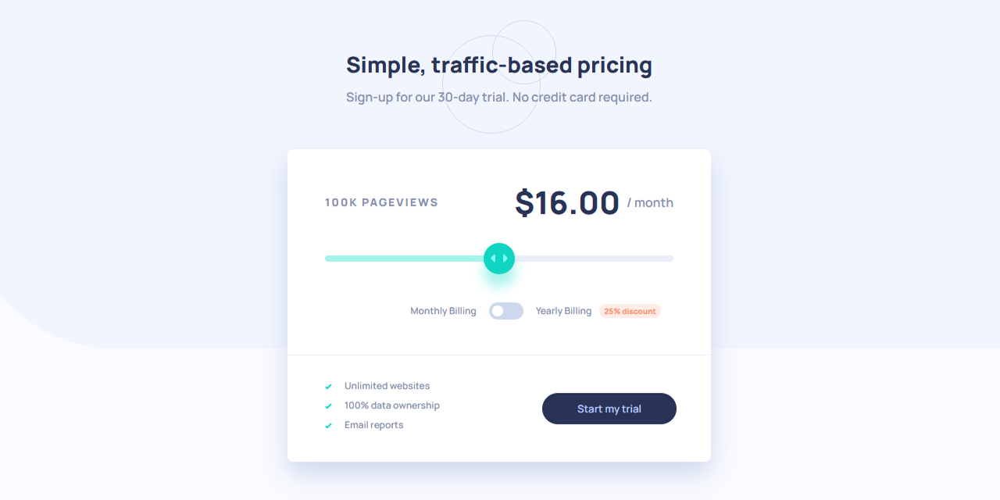

# Frontend Mentor - Interactive pricing component solution

This is a solution to the [Interactive pricing component challenge on Frontend Mentor](https://www.frontendmentor.io/challenges/interactive-pricing-component-t0m8PIyY8). Frontend Mentor challenges help you improve your coding skills by building realistic projects.

This project was bootstrapped with [Create React App](https://github.com/facebook/create-react-app).

To run the application locally: `npm start`

## The challenge

Users should be able to:

- View the optimal layout for the app depending on their device's screen size
- See hover states for all interactive elements on the page
- Use the slider and toggle to see prices for different page view numbers

### Screenshot

### Links

- Solution URL: [Repository](https://github.com/leonardomeza87/interactive-pricing-component)
- Live Site URL: [GitHub Pages](https://leonardomeza87.github.io/interactive-pricing-component/)

### Built with

- CSS custom properties
- Flexbox
- Desktop-first workflow
- [React](https://reactjs.org/) - JS library

### Useful resources

- [Progress bar in an input range](https://stackoverflow.com/questions/38095650/style-input-range-to-look-like-a-progress-bar) - The last answer helped me to make the program bar visible in Google Chrome.

## Author

- Frontend Mentor - [@leonardomeza87](https://www.frontendmentor.io/profile/leonardomeza87)
- Twitter - [@leonardomeza87](https://www.twitter.com/leonardomeza87)
